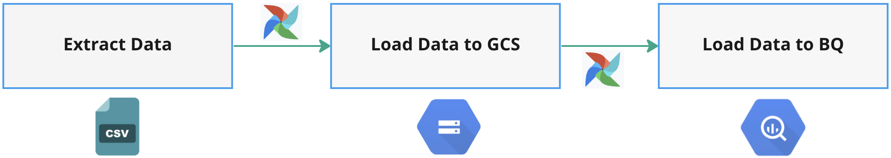
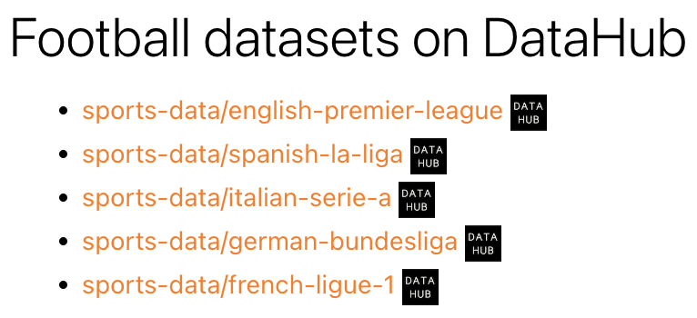
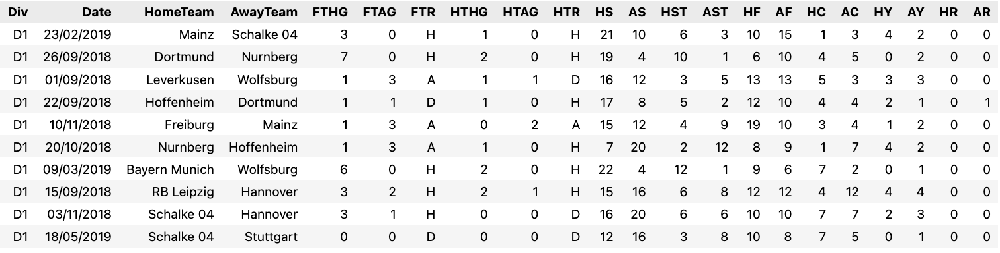

# Extract & Load Football Statistics to GCS & BigQuery

This project aims to extract data from an external data source and load them in Google Cloud Storage & BigQuery.
Please check the <a href="https://medium.com/@baluramachandra90/extract-and-load-football-statistics-to-google-cloud-storage-bigquery-with-airflow-1a217227dbd1" target="_blank">accompanying article</a> for this repo. 

### Data Source
The data that I am going to extract is the football team statistics from top 5 European football leagues on datahub. There are 5 leagues (English Premier League, Spanish La Liga, German Bundesliga, Italian Serie A and French Ligue 1) and 10 seasons (2009/2010–2018/2019) of data stored in csv format. There are 50 csv files that I am going to extract from the data source.

### Additional Resources
- <a href="https://docs.astronomer.io/learn" target="_blank">Learning Airflow with Astronomer</a>.
- <a href="https://www.amazon.com/Data-Pipelines-Apache-Airflow-Harenslak/dp/1617296902" target="_blank">Data Pipelines with Apache Airflow</a>.
- <a href="https://github.com/Balurc/data_eng_zoomcamp/tree/main/week2_data_ingestion" target="_blank">Week 2 course on data ingestion by DataTalksClub</a>.
